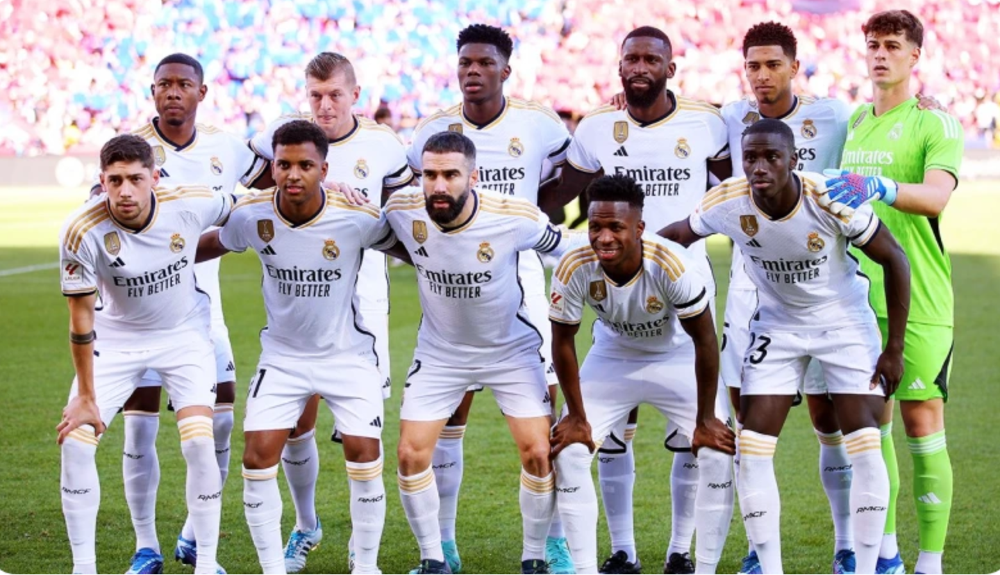

### 실행 결과 비교

| 원본 사진 (Original) | 결과 사진 (Cartoon Rendered) |
| :---: | :---: |
|  |  |

---

### 결과 분석
- **대상:** 2023-2024 레알 마드리드 단체 사진
- **분석:** 
  1. 흰색 유니폼과 배경의 대비가 명확하여 `Adaptive Thresholding`을 통한 외곽선 추출이 매우 효과적으로 이루어짐.
  2. 인물의 이목구비와 유니폼의 로고 등이 만화적 허용 범위 내에서 깔끔하게 표현됨.
  3. `Bilateral Filter`가 피부의 질감을 제거하고 색상을 단순화하여 전형적인 '카툰 렌더링' 효과를 극대화함.

---

### 한계점 및 개선 방향
- **배경 노이즈:** 관중석과 같이 매우 복잡하고 자잘한 패턴이 있는 부분은 외곽선이 점 형태로 나타나 다소 지저분해 보이는 경향이 있음.
- **개선 아이디어:** 이미지의 복잡도에 따라 `medianBlur`의 커널 크기를 조절하거나, 외곽선 추출 전 가우시안 블러를 추가하여 배경 노이즈를 더 억제할 수 있을 것으로 보임.